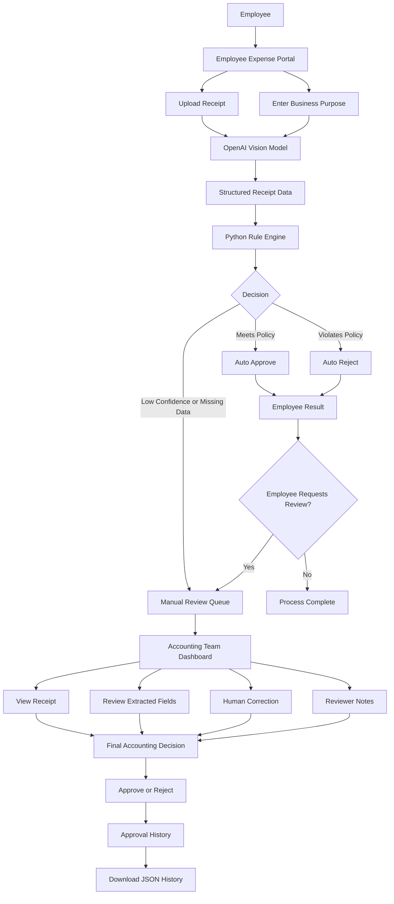

# AI Expense Auditor

A Streamlit-based proof of concept that uses an OpenAI vision model to extract receipt information and a deterministic Python rule engine to evaluate reimbursement eligibility.

The application contains two interfaces:

- **Employee Expense Portal** for receipt submission and reimbursement results
- **Accounting Team Dashboard** for manual review, corrections, final decisions, and approval history

---

## Demo Overview

Employees can upload a receipt and provide the business purpose of the expense.

The system then:

1. Uses an AI vision model to extract receipt information
2. Converts the extracted information into structured JSON
3. Applies deterministic company reimbursement rules
4. Automatically approves, rejects, or routes the expense to manual review
5. Allows employees to request a manual review and provide a reason
6. Allows Accounting reviewers to inspect the receipt, correct fields, and make a final decision

---

## Architecture



---

## System Workflow

```text
Employee uploads receipt
        ↓
AI extracts receipt information
        ↓
Structured JSON output
        ↓
Python rule engine
        ↓
Approve / Reject / Manual Review
        ↓
Employee may request manual review
        ↓
Accounting reviews receipt and extracted data
        ↓
Human correction and final decision
        ↓
Approval history and JSON export
```

---

## Features

### Employee Expense Portal

- Upload JPG, JPEG, or PNG receipt images
- Enter the business purpose of the expense
- Preview the uploaded receipt
- Extract:
  - Vendor
  - Amount
  - Currency
  - Date
  - Expense category
  - Alcohol indicator
- Receive one of three results:
  - Approved
  - Rejected
  - Sent for manual review
- Request a manual review of an automatic decision
- Provide a reason for requesting manual review
- Receive a unique submission reference number

### Accounting Team Dashboard

- View the total number of submitted expenses
- View the number of expenses processed by AI
- View AI-approved expenses
- View AI-rejected expenses
- View expenses requiring manual review
- Expand each manual review request
- View the original receipt image
- View the employee's business purpose
- View the employee's manual review reason
- Review and correct extracted information
- Approve or reject the expense manually
- Add Accounting reviewer notes
- View approval history
- Download approval history as JSON

---

## Expense Policy Used in the Demo

The proof of concept uses the following simplified policy:

- Meals of **$80 CAD or less** are reimbursable
- Meals above **$80 CAD** are rejected
- Alcohol is not reimbursable
- Business transportation is reimbursable
- Hotel expenses are reimbursable
- Low-confidence receipt extraction requires manual review
- Missing or unclear information requires manual review
- Unknown expense categories require manual review

These policies are implemented in Python rather than being decided directly by the AI model.

---

## Key Design Decision

The system separates probabilistic AI extraction from deterministic approval logic.

```text
AI Model
Responsible for:
- Reading the receipt
- Understanding unstructured content
- Extracting receipt fields
- Estimating extraction confidence

Python Rule Engine
Responsible for:
- Applying reimbursement limits
- Rejecting non-reimbursable expenses
- Routing uncertain cases
- Producing consistent approval decisions
```

This design improves:

- Consistency
- Explainability
- Auditability
- Policy control
- Risk management

---

## Human-in-the-Loop Design

The application includes two paths to manual review.

### Automatic Manual Review

A submission is automatically routed to Accounting when:

- AI confidence is below the configured threshold
- The vendor cannot be identified
- The amount cannot be identified
- The category is unknown
- Important receipt information is missing

### Employee-Requested Manual Review

An employee can request manual review when they disagree with an automatic decision.

The employee must provide a reason, such as:

```text
This was a client dinner, and only part of the receipt contained
non-reimbursable items.
```

The Accounting Team can then see:

- The original AI decision
- The original decision reason
- The employee's review request reason
- The original receipt
- The extracted expense information

---

## Project Structure

```text
ai-expense-demo/
├── app.py
├── expense_logic.py
├── prompt.py
├── requirements.txt
├── README.md
├── .env
├── .gitignore
└── pages/
    └── 2_Accounting_Team.py
```

### File Responsibilities

```text
app.py
Employee-facing Streamlit portal

pages/2_Accounting_Team.py
Accounting review dashboard

expense_logic.py
OpenAI API call, data normalization, rule engine, and risk logic

prompt.py
Receipt extraction prompt

.env
Local API key configuration

requirements.txt
Python dependencies
```

---

## Technology Stack

- Python
- Streamlit
- OpenAI API
- OpenAI vision model
- Pillow
- Python dotenv
- JSON
- Streamlit session state

---

## Installation

### 1. Clone the repository

```bash
git clone <your-repository-url>
cd ai-expense-demo
```

### 2. Create a virtual environment

Mac:

```bash
python3 -m venv .venv
source .venv/bin/activate
```

Windows:

```bash
python -m venv .venv
.venv\Scripts\activate
```

### 3. Install dependencies

```bash
pip install -r requirements.txt
```

### 4. Create a `.env` file

```text
OPENAI_API_KEY=your_openai_api_key
```

Do not upload the `.env` file to GitHub.

### 5. Run the application

```bash
streamlit run app.py
```

Open:

```text
http://localhost:8501
```

Use the Streamlit sidebar to switch between:

- Employee Expense Portal
- Accounting Team Dashboard

---

## Current Limitations

This application is a proof of concept.

Current limitations include:

- Data is stored in Streamlit session state
- Data is not permanently saved
- Different users cannot access shared submissions
- There is no user authentication
- There is no role-based access control
- Receipts are not stored in cloud storage
- AI confidence is model-generated and not statistically calibrated
- Expense policies are hard-coded in Python
- There is no duplicate receipt detection
- There is no integration with an enterprise finance platform

---

## Production Architecture

A production version could use:

```text
Employee Portal
        ↓
Microsoft Entra ID Authentication
        ↓
Application API
        ↓
Azure Blob Storage for Receipts
        ↓
Azure Document Intelligence
        ↓
Azure OpenAI
        ↓
Policy and Rule Engine
        ↓
Azure SQL Database
        ↓
Accounting Review Portal
        ↓
Audit Logs and Reporting
```

Potential production improvements:

- Microsoft Entra ID authentication
- Employee and Accounting role-based access
- SQL Server or PostgreSQL persistence
- Azure Blob Storage for receipt images
- Azure Document Intelligence for OCR
- Policy retrieval using RAG
- Duplicate receipt detection
- Fraud and anomaly detection
- Policy version control
- Model monitoring
- Centralized audit logging
- Email or Teams notifications
- Integration with ERP or finance systems

---

## Future Improvements

- Persistent SQL database
- Employee and Accounting authentication
- Role-based authorization
- Receipt duplicate detection
- Fraud risk scoring
- Configurable reimbursement policies
- PDF receipt support
- Email notifications
- Manager approval workflow
- Power BI reporting
- Cloud deployment
- Automated testing
- CI/CD pipeline
